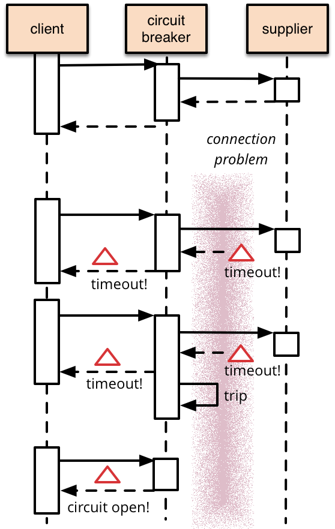

# Microservices

## Table of Contents

- [Microservices](#microservices)
  - [Table of Contents](#table-of-contents)
  - [Microservices as a whole](#microservices-as-a-whole)
    - [What are they](#what-are-they)
    - [Making the decision to use them](#making-the-decision-to-use-them)
    - [Good Resources](#good-resources)
  - [Containers](#containers)
    - [Good Resources](#good-resources-1)
  - [Orchestrators](#orchestrators)
    - [Terminology](#terminology)
    - [Good Resources](#good-resources-2)
  - [API Gateway](#api-gateway)
    - [Implementing an API Gateway](#implementing-an-api-gateway)
    - [Good Resources](#good-resources-3)
  - [Service Discovery and Monitoring](#service-discovery-and-monitoring)
    - [Process](#process)
    - [Additional features: Client-side discovery](#additional-features-client-side-discovery)
    - [Good Resources](#good-resources-4)
  - [Load Balancing](#load-balancing)
    - [Algorithms](#algorithms)
    - [Popular technologies](#popular-technologies)
    - [Good Resources](#good-resources-5)
  - [Handling Errors](#handling-errors)
    - [Circuit Breaking](#circuit-breaking)
    - [Load Shedding](#load-shedding)
    - [Good Resources](#good-resources-6)

## Microservices as a whole

### What are they

Microservices are an architecture style to build a larger application from a set of smaller services/applications. There are many benefits to microservices that can help improve an application's architecture. With the greatest focus being "enabl[ing] the rapid, frequent, and reliable delivery of large, complex applications...and enabl[ing] an organization to evolve its technology stack" (_<https://microservices.io/index.html>_) This happens when the supporting microservices are:

- Highly maintainable and testable
- Loosely coupled
- Independently deployable
- Organized around business capabilities
- Owned by a small team

Microservices are usually characterized by their decomposition of traditionally monolithic applications across business subdomains or shared capabilities (i.e. services based on how the organization is structured vs what problems the organizations solves). However, really any aspect of an application architecture can be pulled out into its own service.

### Making the decision to use them

It all comes down to the balance between benefits and overhead for managing an increased number of services. Microservices take more effort to manage/automate and the increased moving parts introduces new concerns with networking, availability, and security. However, that extra cost can increase development speed, reduce application complexity, increase scalability for individual components, and increase the correlation between organization purpose and technology structures.

### Good Resources

- <https://microservices.io/index.html>

## Containers

Containers are ways to package software applications into a standardized unit that can be run in isolation on an operating system without the need for a virtual machine. This makes the software applications simpler to share and deploy, while reducing the overhead cost for isolating found with VMs.

XKCD also can show us the difference between using VMs (two phones) vs Containers (one app).

The packaging of applications in containers creates an abstraction of the environment the application is run on so the application can be predictably ran in the cloud, data centers, or a developer's personal system.

The portability of containers also increases the ability to share container images with an organization or community. Docker Hub is one registry where public and private images are shared, but an organization can also host their own registry of images.

This portability has also led to the ability to build images on top of existing images, and combine images into a compacted app that runs all the images inter-connectedly.

The most common container is Docker. It is supported across all major platforms: Unix and Windows systems, and used prolifically across AWS, Google Cloud Platform, and Microsoft Azure.

All these facts help show that containerizing our microservices has a lot of benefits for deployment and development.

### Good Resources

- <https://docker-curriculum.com/#dockerfile>

## Orchestrators

The magic portability and predictability from containerization has also opened the door for the orchestration of containers. (e.g. we're able to automate how we manage, scale, and maintain our running images across all sorts of environments). This is because containers effectively guarantee that the application will run the same no matter where it is ran at. The most common orchestrators are _Kubernetes_ and _Docker Swarm_. Both of which come when installing Docker Desktop.

Wherever images are run, orchestration makes it easier to make sure images stay available and on task. So when we make many small services we want to run together we have a way to keep everyone alive and happy.

### Terminology

Here are a few useful terms (as used with Docker Swarm) for understanding orchestration components:

- Swarm
  - a collection of Docker hosts which work together to meet its configured optimal state (number of replicas, network and storage resources, and external ports)
- Node
  - an instance of the Docker engine participating in the swarm
- Manager
  - a node specifically designated to manage swarm membership and delegation
  - swarms start by giving a service configuration to a manager node, who then dispatches work to worker nodes
  - when multiple manager nodes are configured, they elect one leader to control orchestration duties.
  - can also be a worker
- Worker
  - a node running services or tasks in the swarm
- Service
  - the definition of tasks to execute on the manager or worker nodes
  - it includes the images and commands to be execute inside running containers.
  - services can be replicated across multiple containers to meet redundancy, reliability, and availability needs
  - for global services, the swarm runs one task for the service on every available node in the cluster
- Tasks
  - a task has a container and related commands to execute
  - it is the basic scheduling unit of swarm
  - managers assign tasks to workers according to the service definition
  - once a task is assigned to a node, it cannot move to another node and can only run on the assigned node or fail
- Load Balancing
  - request to public ports are routed to the proper services by the swarm manager
  - the manager uses internal load balancing to distribute requests among configured workers

### Good Resources

- <https://docs.docker.com/get-started/>
- <https://docs.docker.com/engine/swarm/key-concepts/>

## API Gateway

One issue created by microservices is the change for clients from hitting just one monolithic endpoint to now various endpoints for different microservices. Just look how messy the data flow for this  mobile client is!!

An API gateway helps solve this problem by creating a single point of contact for clients that will handle request routing, response composition, and protocol translation. This helps remove complexity in the client and different services as the API Gateway can handle the details of different client types and requirements.

### Implementing an API Gateway

- Performance and Scalability
  - API Gateways do best when they are built to support asynchronous, non-blocking requests.
  - Popular technologies supporting this on the JVM side are Netty and Reactor, while Node.js has many options that can fit this flow.
- Using a Reactive Programming Model
  - The previous technologies succeed because of their ability to perform reactive operations. This means that they are able to handle independent requests concurrently, and manage dependent requests without entering callback hell thanks to reactive abstractions such as Futures and Promises.
- Service Invocation
  - Microservices are inherently distributed and need to bridge this gap through either an asynchronous message-system (with a message broker* or directly between services), or a synchronous mechanism (HTTP).
  - It's very common for both to be used within the same microservices environment, including having multiple flavors of each process type.
- Service Discovery*
  - The distributed network means that ip addresses and ports of all the services needs to be tracked. There's not a manual solution since we are harvesting all the benefits of scalable services that grow, move, and shrink as we need them to.
  - This can be done with service or client side discovery with technologies such as Apache Zookeeper.
- Handling Partial Failures
  - When things go south for one dependency, gateways need to be able to fail gracefully, and there's many ways to implement that process.
  - The most popular way is the circuit-breaking* pattern, which stops the client from waiting needlessly for an unresponsive service. If the error rate for a service exceeds a set threshold, the circuit breaker is tripped and all requests using that service fail immediately for a specified period of time. With the circuit breaker checking to see when it can resume operations based on its configurations.

*these topics have their own sections later on

In short, an API Gateway is a great asset for microservice environments because of the single point of entry to access services, the customization it can abstract away from clients and services, and protecting service health through handling failures and caching data.

### Good Resources

- <https://www.nginx.com/blog/building-microservices-using-an-api-gateway/>

## Service Discovery and Monitoring

All real-world applications have some sort of communication outside of themselves. With microservices, this inherent connection attribute is amplified by the sheer increase in the number services and further compounded by the complexity of the scaling of instances for each service.

Service discovery and monitoring is the mechanism microservices use to manage these connections and keep the whole environment operating smoothly at any scale. Historically, service discovery has its roots in the HOSTS.TXT file, which was replaced by DNS as the internet grew exponentially. Today, service lifecycle can be largely be measured in minutes and seconds as services are spun up and shut down. This led to the need for a dynamic resource to track service addresses and ports within the contained microservice environment.

Today, there are three common approaches to service discovery:

1. Using existing DNS setup
2. Using a generic key-value datastore (e.g. Apache Zookeeper, Consul, etcd)
3. Using a specialized service discovery program (e.g. Netflix Eureka)

The most popular are options #2 and #3. #2 seems to be more prevalent as companies had existing tools that could handle service discovery, and they implemented those when their service discovery needs came up instead of finding/building a new service like #3. I spent more time trying to figure out the specifics of Eureka than I liked too, and still can't tell what it does special outside of being primarily a better solution if you are focused on availability over consistency and your microservices live in AWS.

### Process

The Service Discovery lifecycle is broken down into two main components: Service Registration and Service Resolution. Registration is where microservices let the discovery mechanism know their location and health status. Resolution is where clients access the mechanism to find an available, healthy service to fulfill their needs.

### Additional features: Client-side discovery

Well everything I've summarized so far involves clients accessing services through an external mechanism, there are add-ons to this methodology to make clients directly aware of the registry. This enables them to do their own load-balancing without routing the request through a middle-man. Really, this option just boils down to your situations balance between network or application complexity.

### Good Resources

- <https://www.datawire.io/guide/traffic/service-discovery-microservices/>
- <https://microservices.io/patterns/client-side-discovery.html>

## Load Balancing

In a simple definition, load balancing is the practice of distributing incoming network traffic/requests to a pool of compute resources based on a certain strategy. Normally, load balancing is found between clients and web servers to help manage the supply and demand of handling requests. In a microservice architecture, every service also becomes a consumer and producer of network traffic and load balancing is implemented between services to solve similar issues.

Taking a look at everything we've talked about already, we have an issue with networking ambiguity, because every service can either be a single resource or a collection of resources! We could implement logic on every single service to handle looking up all the target services/resources we need at the time of a request and then deciding which specific instance to use. But what happens if the chosen resource goes down during that processing time? Now we need to handle that in all of our requests. Or what if we go down before they can respond?? There's so much state we are bundling into the logic of every single application we write that we've created this epidemic bloat that will infect all of our services. Following the (pirate) code of microservice architecture where every service should only do one thing, which should abstract load handling out into a load handler.

### Algorithms

- Round Robin: Requests are sent to servers in a sequential order
  - Pros: Simple and concise
  - Cons: Requests varying in size can lead to servers being bogged down as they get more work than others
- Least Connections: Requests are sent to the server currently with the least number of connections in comparison to it compute power
  - Pros: Still simple, but a smarter spread to prevent naive queue build-up
  - Cons: Takes time to query and calculate this equation for each request
- Least Time: Choose the server based on recent response times and fewest active connections
  - Pros and cons are similar (but less severe) than Least Connections because it's using internal data instead of querying the server for every new request
- Hash: Map a hash algorithm to the available servers and send the request based on hashing some of the request data
  - Pros: Fast, balance of consistency and randomness in the chosen hash algorithm and mapping evenly distribute the requests while avoiding build up in the request queues
  - Cons: not addressing the current load of servers
- IP Hash: specifically using the client's IP address for the hash
- Random with N Choices: Pick N servers at random and send the request based on a Least Connections or Least Time algorithm
  - Pros: Combine randomness benefits on top of another algorithm's strengths, good for large pools of servers, gives configurable balance between random selection and applied algorithm
  - Cons: Weaknesses of the applied algorithm, improperly balanced random selection can reduce algorithm efficiency

### Popular technologies

- F5
- Citrix
- NGINX Plus (Web server with balancing built in)
- Amazon Elastic Load Balancing (ELB)
- Zevenet
- LoadMaster

### Good Resources

- <https://www.nginx.com/resources/glossary/load-balancing/>

## Handling Errors

So far we've looked at what happens when everything goes according to plan with microservices. But I've heard enough quotes of Murphy's law to know that's not going to always be the case. We need to have measures to handle when our load is too much for our own or dependent services.

### Circuit Breaking

The more popular of these issues to address is when the services we rely on are less responsive than we need them. Piggybacking off of electrical systems (which is literally how software runs) and their concept of circuit breakers we can write our service code to handle this issue by watching the connection health and deciding to open the breaker and short-circuit every request to that service since we believe it's going to fail anyways. The following image shows the essence of what we just described.

So how will we know when we can close the circuit (loop) back up and get back to business as usual? Or what if it's just a slower response than normal and not totally unresponsive? This is where we can give some state to the circuit breaker to control the right level of flow and monitoring.

The states of a circuit-breaker are 1) closed, 2) open, and 3) half-open.

Closed means our connections are completely healthy and we can push every request through the full loop/circuit. Closed is really like a good left green arrow.

Open means the connection is so unhealthy that we are assuming things will fail and want to handle the failure without sending requests along. (We'll also secretly let a few requests through every so often to check the connection status so we can close back up). Open is our red arrow telling us to back off.

This makes half-open our flashing yellow. Being half-open means that our connection isn't fully healthy/clear, but that we can still sneak some requests through. So we'll send requests when we think we can, but will fail them prematurely if we think they can't make it.

### Load Shedding

Less talked about is handling when we have too much load for our own service(s). We've created an infrastructure up to this point that can scale horizontally at a factor of N computing nodes and have a mechanism (Load Balancing) to share work across our nodes. But due to the shortcomings of our balancing algorithms we build up a queue of requests at nodes that receive a disproportionate of the load. One option to work with this imbalance is by dropping excess requests in the queue in a way that let's our client know to try again to get a less busy node. This is Load Shedding.

Now, let's start off by saying it's a bad thing to return failure responses, but we're in between a rock and a hard place with n-factorial potential failure points and our physical compute limits at any given time. SOOO we have to make a choice that will potentially lengthen the response time of some requests, but hopefully also keep our average response times low and manageable during those hard times.

Let me share a story from a brilliant article about Scaling React Server Side Rendering by [@arkwright](<http://arkwright.github.io/scaling-react-server-side-rendering.html>). His company had "a freak operations accident" where a misconfiguration restarted every instance of a service all at once. They all started to come back on, and, as soon as the first node came back online, all the traffic was routed to it causing complete failure and cascading down across each node starting up since they would each get 100% of the load traffic right after taking their first breath. Situations like this are what nightmares are made out of.

Load shedding solutions aren't as cut and dry as balancing algorithms because we want the scalpel of the surgeon and not the cleaver of the butcher to allow these scars to heal more beautifully. We can use the same principles though of balancing randomness and algorithms to set up this success. As examples with good principles, @arkwright applied three simultaneous load shedding techniques to solve their issues (on top of a round robin load balancing strategy).

First, they wanted to decrease the load on the server in rendering their React components during high traffic times. Luckily, they were using Redux and had the potential to either return a rendered component to the client or the underlying Redux data. So, when the request queue was above a certain size, responses were returned of the redux data to push rendering to the client and speed up the average response time.

Second, they still wanted to keep total queue lengths under a certain size and return a failed response for requests coming in over that limit. (Basically the vanilla load shedding strategy on top of their previous stretching of node capacity).

After all of this they still realized that they had an issue where the incoming requests they wanted to shed had to wait through the whole queue of requests before being shed. (They didn't want to shed the earlier ones because it's better to return a fast failure than a latent failure for clients).

Being a JavaScript process, it wasn't possible to start up new threads to make it through to the end of the queue. So they introduced "interleaved shedding" with the Node event loop to balance responding to requests and receiving them. This involved loading requests planned to be render into a seperate collection that would be drawn from to be rendered in between the gaps of receiving and potentially rejecting requests. This allows for fast failure while adding minimal overhead to the successful requests

Eventually they moved to spinning up multiple Node processes on each compute node to make this a more capable/defined process.

In conclusion, The best practices behind Load Shedding are ambiguous at best, but a little bit of brain power here can go a long way to helping grow a scalable and robust microservice framework.

### Good Resources

- <https://martinfowler.com/bliki/CircuitBreaker.html>
- <http://arkwright.github.io/scaling-react-server-side-rendering.html>
